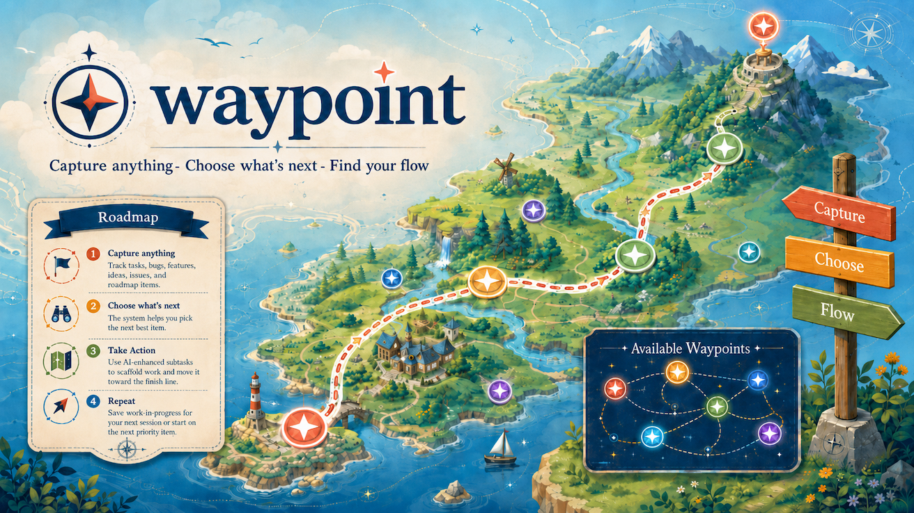

# waypoint



**Capture anything. Choose what's next. Find your flow.**

AI-native task management for [Claude Code](https://claude.com/claude-code). Track tasks in a `ROADMAP.md` file, choose what to work on, save progress, and ship — all through agent skills.

```
/waypoint:add  →  create  →  /waypoint:next  →  pick  →  /waypoint:save  →  pause  →  /waypoint:done  →  ship
```

## Quick Start

**Step 1** — Install the plugin (run these two lines inside Claude Code):

```
/plugin marketplace add jcbmrrs/waypoint
/plugin install waypoint
```

**Step 2** — Create your first task:

```
/waypoint:add
```

That's it. If your project doesn't have a `ROADMAP.md` yet, the plugin creates one automatically in `docs/ROADMAP.md`.

**Step 3** — Work the loop:

```
/waypoint:next     Pick what to work on
                   ... write code ...
/waypoint:save     End of session? Save WIP + push
                   ... next day, different machine ...
/waypoint:next     Pick up where you left off
                   ... finish the task ...
/waypoint:done     Test + commit + push + mark complete
```

> **Already have tasks in a ROADMAP.md?** The plugin works with any existing file as long as tasks use `### TASK-123: Title (STATUS)` headers. Run `/waypoint:next` to start picking from your existing backlog.

## Why?

- **Zero infrastructure** — Just a markdown file + git. No Jira, no Linear, no database.
- **AI-native** — Claude reads the plan, scores priorities, picks tasks, updates status, runs tests, commits. You just approve.
- **Session-resilient** — `/save` your work, switch machines, come back tomorrow, `/next` picks up where you left off.
- **Self-documenting** — The ROADMAP.md IS the project history. Nothing to keep in sync.
- **Any language, any framework** — Works with Node, Python, Rust, Go, or anything else. Auto-detects your test runner.
- **Cross-platform** — Built on the [Agent Skills open standard](https://agentskills.io). Core functionality works in Claude Code, Cursor, GitHub Copilot, Windsurf, and other compatible tools. Interactive task picking is best in Claude Code.

## Skills

### `/waypoint:add` — Create a Task

Creates a new task with an auto-generated sequential ID. If no `ROADMAP.md` exists, creates one from a starter template.

```
> /waypoint:add

Using task number: 42

? Type: TASK / BUG / FEATURE / INQUIRY
? Priority: P0 (critical) → P3 (backlog)
? Title: Add user authentication

Task added to ROADMAP.md:
- ID: TASK-42
- Title: Add user authentication
- Priority: P1
- Status: PLANNED
```

### `/waypoint:next` — Pick What to Work On

Reads your ROADMAP.md, scores tasks by priority and status, shows an interactive picker. Highlights in-progress tasks so you finish what you started.

```
> /waypoint:next

You have 1 task in progress.

? Which task would you like to work on?
  ● TASK-42: Add user authentication    P1 · PLANNED
    BUG-38: Fix login redirect          P0 · PLANNED
    TASK-40: Refactor API layer         P2 · IN PROGRESS
    Show more tasks...

> [Selects TASK-42, shows full details, offers to start working]
```

**Filters:** `/waypoint:next bugs` · `/waypoint:next planned` · `/waypoint:next active` · `/waypoint:next review`

### `/waypoint:save` — Save Work-in-Progress

Commits and pushes without marking the task done. No tests, no ceremony — just save and go. Perfect for switching machines or ending a session.

```
> /waypoint:save

## Progress Saved
- Task: TASK-42
- Summary: Added login form and validation
- Commit: a1b2c3d — wip(TASK-42): Added login form and validation
- Status: Still IN PROGRESS

Ready to continue on another machine:
  git pull → /waypoint:next
```

### `/waypoint:done` — Ship It

The full completion workflow: verify each subtask, run tests, commit, push, and mark the task done — but only when it's genuinely complete.

```
> /waypoint:done

## ✅ Task Complete
- Task: TASK-42
- Tests: ✅ Passed
- Subtasks: ✅ All complete
- Commit: d4e5f6g — feat(TASK-42): Add user authentication
- Push: ✅ Pushed to origin
- ROADMAP.md: ✅ Moved to Completed
```

If any subtasks remain incomplete, the task stays IN PROGRESS and you get a clear list of what's left — no silent gaps.

**Test auto-detection:** `npm test` · `pytest` · `cargo test` · `go test ./...` · `make test`

**Commit format:** `feat(TASK-XXX):` for features, `fix(BUG-XXX):` for bugs, `wip(TASK-XXX):` for saves.

## The Workflow

```
Start session
    │
    ▼
/waypoint:next          ← Pick a task (scored by priority)
    │
    ▼
  Work on it            ← Write code, debug, iterate
    │
    ├──► Need to stop?  → /waypoint:save (WIP commit + push)
    │                      Come back later, git pull, /next
    │
    ├──► Found a bug?   → /waypoint:add (log it, keep working)
    │
    └──► Done!          → /waypoint:done (verify + test + commit + push)
         │
         ▼
    /waypoint:next      ← Pick the next task
```

## ROADMAP.md Format

The plugin reads and writes tasks in this format:

```markdown
### TASK-42: Add user authentication (IN PROGRESS)
**Priority**: P1
**Status**: IN PROGRESS (2026-02-23)

Description of the task...

**Tasks**:
- [ ] Create login form
- [x] Set up auth provider
```

**Statuses:** `PLANNED` · `IN PROGRESS` · `REVIEW` · `PAUSED` · `✅ DONE`

**When a task is marked done**, it gets strikethrough on the ID, moves to `## Completed`, and all subtasks must be checked:

```markdown
### ~~TASK-42~~: Add user authentication (✅ DONE)
```

Tasks can also appear in a roadmap table — the plugin updates both locations automatically.

> **Starting fresh?** Run `/waypoint:add` and the plugin creates the file for you. A starter template is also available at [`templates/ROADMAP.md`](templates/ROADMAP.md).

## Task ID Format

| Prefix | Usage |
|--------|-------|
| `TASK-XXX` | Features and improvements |
| `BUG-XXX` | Bug fixes |
| `FEATURE-XXX` | Major features |
| `ROAD-XXX` | Roadmap items |
| `IDEA-XXX` | Ideas for later |
| `ISSUE-XXX` | Known issues |
| `INQUIRY-XXX` | Investigations |

IDs are **globally sequential** across all types. If TASK-42 and BUG-43 exist, the next ID is 44.

## Team Install

Commit this to your project's `.claude/settings.json` and teammates are prompted to install automatically:

```json
{
  "extraKnownMarketplaces": {
    "jcbmrrs-tools": {
      "source": { "source": "github", "repo": "jcbmrrs/waypoint" }
    }
  },
  "enabledPlugins": {
    "waypoint@jcbmrrs-tools": true
  }
}
```

## Requirements

- [Claude Code](https://claude.com/claude-code) (or any [Agent Skills](https://agentskills.io)-compatible tool)
- Git

No npm install, no build step, no external dependencies. The skills are pure markdown — Claude does the parsing.

## Contributing

Issues and PRs welcome at [github.com/jcbmrrs/waypoint](https://github.com/jcbmrrs/waypoint/issues).

## Attribution

This project is a fork of [endlessblink/master-plan](https://github.com/endlessblink/master-plan), which introduced the original concept of AI-native task management via Claude Code skills. It has been renamed, redesigned, and extended with improved subtask verification, stricter completion semantics, and an ADHD-friendlier workflow.

## License

MIT
